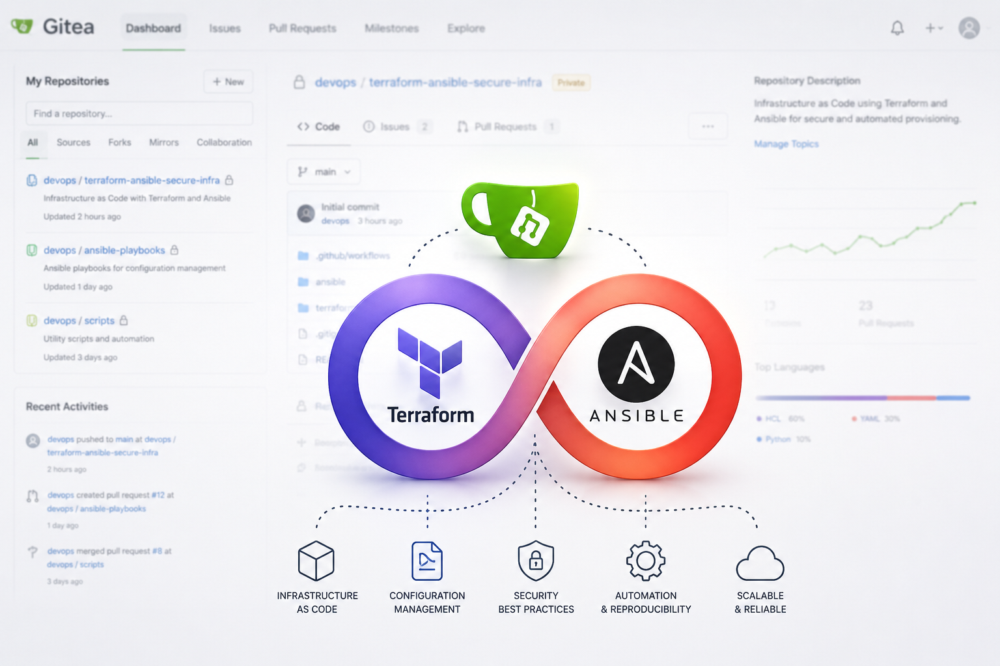
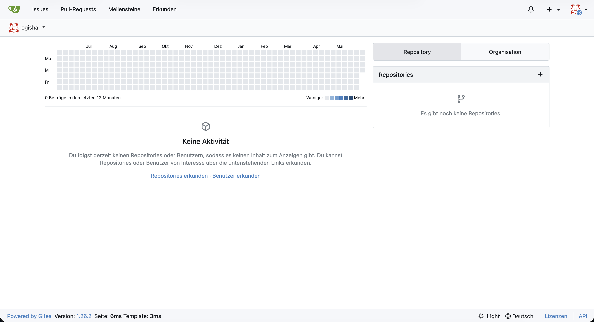
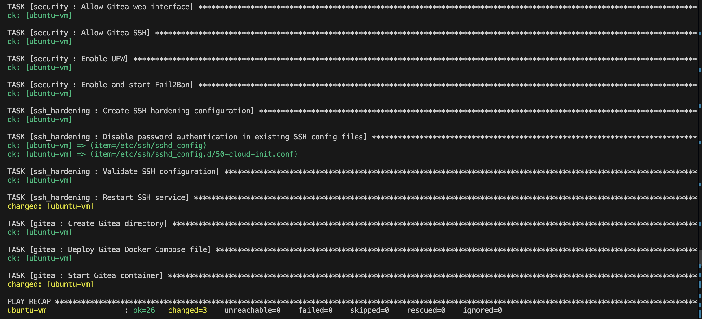
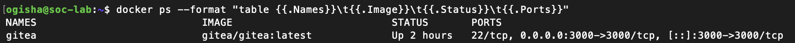
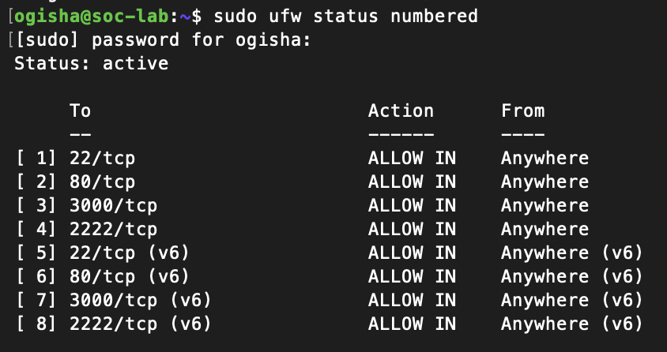
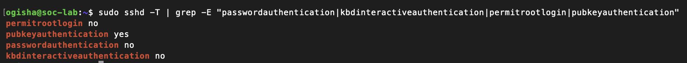

# Terraform & Ansible Secure Gitea Lab

<p align="center">
  
</p>

> Infrastructure as Code and Configuration Management project focused on automated Linux server provisioning, Docker deployment, and SSH hardening inside a local virtualization lab.

---

# Table of Contents

- [Overview](#overview)
- [Project Goals](#project-goals)
- [Why Terraform?](#why-terraform)
- [Why Ansible?](#why-ansible)
- [Lab Architecture](#lab-architecture)
- [Technologies Used](#technologies-used)
- [Project Structure](#project-structure)
- [Environment Setup](#environment-setup)
- [VirtualBox Networking](#virtualbox-networking)
- [SSH Configuration](#ssh-configuration)
- [Ansible Inventory](#ansible-inventory)
- [Ansible Roles](#ansible-roles)
- [Dockerized Gitea Deployment](#dockerized-gitea-deployment)
- [GitHub Actions CI Validation](#github-actions-ci-validation)
- [Security Features](#security-features)
- [Screenshots](#screenshots)
- [Learning Outcomes](#learning-outcomes)
- [Conclusion](#conclusion)

---

# Overview

This project demonstrates how to automate the deployment and hardening of a Linux-based Git server using Terraform, Ansible, Docker, Gitea, GitHub Actions, and Linux security best practices.

The environment was built inside a local virtualization lab using a macOS control node and an Ubuntu Server VM running in VirtualBox.

Instead of configuring the server manually, the entire environment can now be recreated automatically using Infrastructure as Code and Configuration Management principles.

---

# Project Goals

The primary objective of this project was to gain hands-on experience with:

- Infrastructure as Code (IaC)
- Linux server automation
- Dockerized deployments
- Configuration management
- Secure remote administration
- SSH hardening
- Firewall management
- CI validation workflows

The project focuses on reproducibility, automation, and security.

---

# Why Terraform?

Terraform is an Infrastructure as Code (IaC) tool developed by HashiCorp.

Terraform allows infrastructure to be defined declaratively instead of being configured manually.

In this project, Terraform was used to:

- Learn Infrastructure as Code concepts
- Create a structured infrastructure workflow
- Validate Terraform configurations
- Understand reproducible infrastructure deployments

Although this project runs locally inside a VM environment, the same concepts can later be applied to cloud platforms such as AWS, Azure, DigitalOcean, Hetzner, or Google Cloud Platform.

---

# Why Ansible?

Ansible is a configuration management and automation tool.

Instead of manually typing Linux commands on the server, Ansible automates the entire setup process.

This project uses Ansible to automate:

- Package installation
- Docker installation
- Firewall configuration
- Fail2Ban installation
- Gitea deployment
- SSH hardening
- Service management

If the server fails, the complete environment can be recreated automatically using a single playbook.

---

# Lab Architecture

```text
MacBook (Control Node)
│
├── Terraform
├── Ansible
├── VS Code
├── GitHub
└── SSH

            │
            │ SSH
            ▼

Ubuntu Server VM (Managed Host)
│
├── Docker
├── Gitea
├── UFW Firewall
├── Fail2Ban
└── Hardened SSH Configuration
```

---

# Technologies Used

## Infrastructure & Automation

- Terraform
- Ansible
- GitHub Actions

## Operating System

- Ubuntu Server 24.04 LTS

## Virtualization

- VirtualBox

## Containerization

- Docker
- Docker Compose

## Self-Hosted Service

- Gitea

## Security

- UFW Firewall
- Fail2Ban
- SSH Hardening
- SSH Key Authentication

---

# Project Structure

```text
terraform-ansible-secure-infra/
│
├── terraform/
│   └── main.tf
│
├── ansible/
│   ├── inventory/
│   │   └── hosts.ini
│   │
│   ├── playbooks/
│   │   ├── site.yml
│   │   └── group_vars/
│   │       └── gitea.yml
│   │
│   └── roles/
│       ├── common/
│       ├── docker/
│       ├── security/
│       ├── ssh_hardening/
│       └── gitea/
│
├── .github/
│   └── workflows/
│       └── validate.yml
│
├── ansible.cfg
├── .gitignore
└── README.md
```

---

# Environment Setup

The project environment consists of:

| System | Purpose |
|---|---|
| macOS | Control Node |
| Ubuntu Server VM | Managed Host |
| VirtualBox | Virtualization |
| SSH | Remote Management |

The macOS machine acts as the Ansible control node while the Ubuntu VM acts as the managed target system.

---

# VirtualBox Networking

The Ubuntu VM was configured using:

- NAT Networking
- Port Forwarding

Forwarded ports:

| Service | Host Port | Guest Port |
|---|---|---|
| SSH | 2222 | 22 |
| Gitea Web UI | 3000 | 3000 |

Example SSH connection:

```bash
ssh user@192.168.x.x -p 2222
```

---

# SSH Configuration

SSH was configured between the macOS control node and the Ubuntu VM.

The project uses:

- SSH key authentication
- Disabled password authentication
- Disabled root login

This significantly improves remote access security.

---

# Ansible Inventory

Example:

```ini
[gitea]
ubuntu-vm ansible_host=192.168.x.x ansible_port=2222 ansible_user=user
```

The inventory defines:

- Target host
- SSH port
- SSH user
- Host grouping

---

# Ansible Roles

## Common Role

Installs general Linux packages and updates the operating system.

Installed packages include:

- curl
- wget
- git
- unzip
- ca-certificates
- gnupg

---

## Docker Role

Automates Docker installation and configuration.

Tasks performed:

- Removes conflicting packages
- Adds official Docker repository
- Installs Docker Engine
- Installs Docker Compose
- Starts Docker automatically
- Adds user to Docker group

---

## Security Role

Configures:

- UFW Firewall
- Fail2Ban
- Firewall Rules

Allowed ports:

| Port | Purpose |
|---|---|
| 22 | SSH |
| 3000 | Gitea Web Interface |

Default policy:

```text
deny incoming
```

---

## SSH Hardening Role

Improves remote access security by:

- Disabling root login
- Disabling password authentication
- Enabling SSH key authentication
- Disabling empty passwords

The project also demonstrates troubleshooting Ubuntu SSH configurations using:

```text
/etc/ssh/sshd_config.d/
```

---

## Gitea Role

Automates the deployment of a self-hosted Git service.

Tasks performed:

- Creates deployment directories
- Deploys Docker Compose configuration
- Configures environment variables
- Starts the Gitea container automatically

---

# Dockerized Gitea Deployment

Gitea was deployed using Docker Compose.

The deployment includes:

- Persistent Docker volumes
- Environment variables
- Automatic restart policies
- Containerized isolation

---

# GitHub Actions CI Validation

GitHub Actions were added to validate the infrastructure code automatically.

Validated components:

- Terraform formatting
- Terraform configuration
- Ansible syntax
- YAML formatting

Example validation commands:

```bash
terraform fmt -check -recursive
terraform validate
ansible-playbook --syntax-check
yamllint .
```

---

# Security Features

This project includes several security-focused components:

- SSH Hardening
- SSH Key Authentication
- UFW Firewall
- Fail2Ban
- Docker Isolation
- Infrastructure as Code
- Automated Configuration Management

---

# Screenshots

## Gitea Dashboard



---

## Successful Ansible Playbook Execution



---

## Docker Container



---

## UFW Firewall Status



---

## SSH Hardening Validation



---

# Learning Outcomes

This project provided practical experience with:

- Infrastructure as Code
- Linux Administration
- Docker Automation
- Secure Remote Access
- Configuration Management
- CI Validation Workflows
- Infrastructure Validation
- DevSecOps Concepts
- SSH Troubleshooting
- Linux Service Troubleshooting

---

# Conclusion

This project demonstrates how modern Linux infrastructure can be automated using Infrastructure as Code and Configuration Management tools.

Instead of manually configuring systems, the entire environment can now be recreated consistently and securely using:

- Terraform
- Ansible
- Docker
- GitHub Actions

The project also demonstrates practical Linux hardening, automation workflows, and DevSecOps concepts inside a realistic local lab environment.
